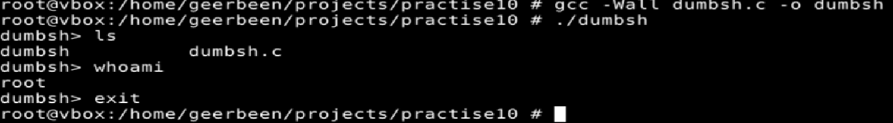
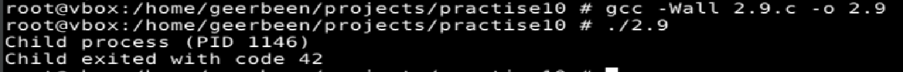
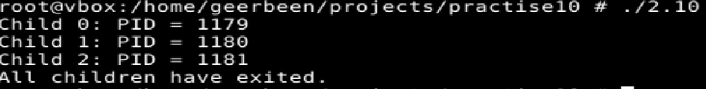
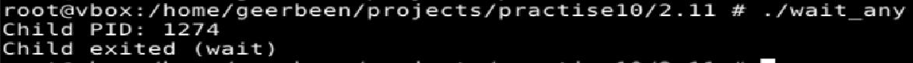
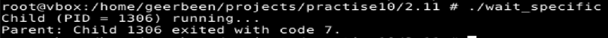
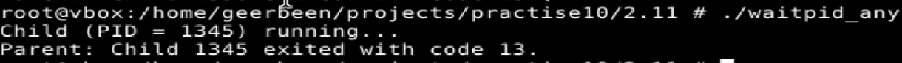
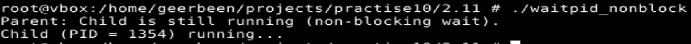
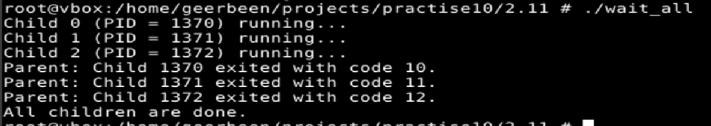
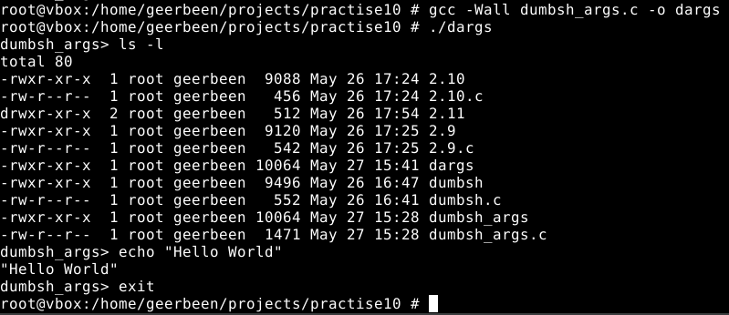

# ТВ-32 Михайленко Роман Практична 9
## Варіант 13
### Завдання 2.7, 2.8
Протестовано наданий код
   
### Завдання 2.9  
Модифікував код прикладу - додав вивід в термінал та перемістив код в функцію.
   
### Завдання 2.10  
Написав код, який створює три дочірні процеси. Кожен виводить свій `PID`, батьківський чекає на закінчення всіх і виводить інформацію про їх закінчення.
   
### Завдання 2.11  
Для кожного випадку написана програма для демонстрації і перевірки роботи.  
Очікування будь якого:
   
Очікування одного з вказаним `PID`:   
   
Очікує будь якого, але вже з використанням `waitpid`   
   
Неблокуючий виклик:  
   
Чекає всіх:  
   
### Завдання 13  
Було модифіковано перше завдання з оболонкою.  
Код в циклі зчитує ввід користувача, прибираючи перенос строки. Якщо було введено `exit` - виходить, інакше розбиває ввід на аргументи через пробіл. Створює дочірній процес і виконує в ньому команду через `execvp()`. Батьківський процес чекає закінчення дочірнього. При помилці виводить повідомлення.
   

