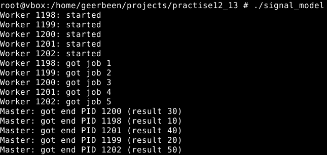

# ТВ-32 Михайленко Роман Практична 12-13
## Варіант 13
### Завдання
>Побудуйте багатопроцесну модель, де головний процес розподіляє завдання за допомогою сигналів, а робочі повідомляють про завершення також через сигнали.
### Виконання
Головний процес створює `NUM_WORKERS` дочірніх - робітників. Робітник чекає сигналу `SIGUSR1` з завданням, виконавши робітник надсилає результат назад через `SIGUSR2`. Головний процес ловить ці сигнали та виводить повідомлення про закінчення.  
`void handle_done()` використовується для обробки сигналів результатів `SIGUSR2`, викликається коли робітник присилає сигнал.  
`void worker_handler()` використовується для обробки надходження завдань, викликається у робітнику.  
У функції `main()` налаштовується обробник сигналів для основого процесу, створюються дочірні процеси.
У дочірніх процесах встановлюємо обробник `SIGUSR1` та чекаємо сигналу залишаючи його жити. У головному зберігаємо PID. Надсилаємо завдання дочірнім процесам з сигналом `SIGUSR1`. Далі очікує відповідей.
   

