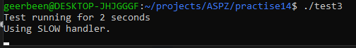

# ТВ-32 Михайленко Роман Практична 14
## Варіант 13
## Завдання
>Дослідіть поведінку POSIX-таймерів при високому навантаженні (запуск сигналу частіше, ніж програма встигає обробити).

## Виконання
Для порівнння тести буде виконано в `FreeBSD` та `Ubuntu`.  
### Тест 1
Перший тест досліджує чи встигатимуться оброблюватись дуже часті надсилання сигналу, з інтервалом 0.1 мс.  
`FreeBSD` змогла обробляти від 5 до ~150 сигналів за 2 секунди.  
   
В той же час `Ubuntu` обробляє від 500 до ~1900 сигналів, що значно більше. Але все ще небагато, якщо вважати, що код намагається надіслати `10 000 * 2 = 20 000 сигналів`.   
   
Така розбіжність в кількості сигналів між двома системами пояснюється їх внутрішною будовою та обмеженнями, що досить очевидно. Сигнали, які не були оброблені просто втрачаються, встати в чергу на обробку можуть не всі, адже їх забагато і вона має обмежений розмір. Але різниця між двома запусками в одній системі вже цікава, це скоріш за все відбувається через те як я рахую час.   
Цикл `while (time(NULL) - start < 2);` в мінімальному випадку виконується ~1 секунди (якщо почався виконуватись близько до кінця секунди `x.999`), а максимально ~2 секунд (якщо почаав виконуватись на початку секунди `x.001`).  
### Тест 2
Цикл з яким я відслідковую час насправді досить ресурсозатратний, через що значення можуть бути нерелевантними, тому було вирішено використати трохи інший підхід з `pause();`.  
Тепер процесор не буде завжди завантаженим на максимум, а процес виконання буде призупенено, до моменти поки сигнал не надійде. По ідеї так ядро зможе працювати ефективніше - швидше доставляючи сигнали.   
   
Результат насправді не дуже порадував, кількість оброблених сигналів не змінилась сильно, скоріше в межах похибки. Хоча для багатьох спроб відстуні результати типу 5 сигналів.  
Виходить, що незалежно від коду, я просто впираюсь в обмеження самої системи, або віртуальної машини. Сигнали просто втрачаються, а обробляється `~1%`.  

Тим часом поведінка цього тесту в `Ubuntu` цікавіша:  
   
Дійсно вийшло, що з pause() все набагато швидше і тепер обробляються `99%` замість `1%`. Можу підозрювати, що це через те як запущені ці системи, `Ubuntu` працює в `WSL2`, яке має майже або повноцінне ядро `Linux` у дуже легкій і оптимізованій віртуальній машині, через що є такою швидкою.
### Тест 3
В цьому тесті я намагався зробити обробник штучно повільним. Для цього я запихнув в функцію обробник довгий цикл з декількома математичними операціями та при компіляції вимкнув оптимізацію `-O0` щоб надто розумний компілятор не видаляв цикл і не обраховував його наперед.
   
Повільний обробник не зміг сповільнити і так повільну обробку сигналів у `FreeBSD`.

А в `Ubuntu` повільний обробник взагалі не зміг відпрацювати, програма банально зависала на вічно при обробці.  
   
В той же час, якщо зменшити кількість ітерацій в циклі повільного обробника, то все відпрацьовавуло як і для швидкого обробника.
### Доповнення до тесту 3
Я написав програму, яка б вимірювала час виконання цього обробника. Він і справді повільний.   
    
для 1000 викликів виконувалось більше 8 секунд, але черга не настільки велика щоб вміщати більше 1000 сигналів, вони мають просто губитись. Тому це не дуже пояснює чому програма зависала (або просто довго виконувалась).  
Логічним був би сценарій коли після генерації `SIGALARM` (через 2 сек після початку) таймер продовжував би генерувати сигнали, поки `SIGALARM` ще висить, але не оброблений. Та система мала б все таки обробити вихід і програма закінчилась би не сильно пізніше тих 2 секунд.