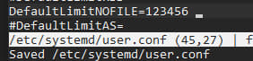

# ТВ-32 Михайленко Роман Практична робота 3
## Завдання 1
В ОС Ubuntu  я запустив вказані у завданні команди та отримав наступний результат:  
  
Бачимо, що hard limit зменшувався разом з soft limit, це пов'язано з тим, що команди за замовчуванням виконується від root. Але я не зміг збільшити hard ліміт, можливість це робити має тільки хост система, тобто хтось вищий за рут. Для цього треба було б перезапусити докер з відповідним більшим параметром хард ліміту.

## Завдання 2
Моя операційна система не підтримує perf, тому я вирішив іншим способом поекспериментувати з лімітами. Я встановив ліміт на розмір файлу, та створив програму що нескінченно записує в файл. Але так як я встановив занадто маленьке обмеження, то навіть не зміг скомпілювати файл, через те, що він вже був занадто великий. Так я дізнався що обмеження справді працюють навіть не запустивши програму =).   


Після цього я скинув ліміт та попердньо скомпілював програму, а вже потім встановив ліміт та запуситв її, очікувано отримав помилку:


## Завдання 3
Я написав програму яка записує у файл випадкові значення, що імітують кидання кубика у файл, що обмежений розміром. В кінці виводяться очікуваний та реальний розмір файлу.  
Для отримання розміру файлу було використано struct stat з <sys/stat.h> - отримуємо інформацію з метаданих про файл.  
Обмеження реалізоване в самому коді, так як не знайшовся спосіб встановити обмеження для конкретного файлу на рівні системи. Також встановлювати обмеження не в програмі було б досить дивно.
  
...  


## Завдання 4
Було створено програму імітуючу роботу лотереї, але її роботу буде обмежено max cpu time, тому програма містить обробник max cpu time, на випадок того, якщо програма досягне цього ліміту.  
Реалізовано фукнцію що заповнює масив випадковими числами у заданому діапазоні у заданій кількості.
Алгортим:
1) приймається посилання на заповнюваний масив, кількість потрібних чисел, максимальне число
2) нулями ініціалізується перевірочний масив довжиною в максимальне число
3) зовнішній цикл ітерується по кількості чисел
4) створюється змінна для випадкового числа
5) в do генерується випадкове число в цю змінну, у while за допомогою перевірочного масиву перевіряється чи було вже це число, якщо було то генерується заново
6) число додається в переданий масив та вказується як використане  

Функцію обробки cpu limit.
Відловлюється сигнал SIGXCPU - встановлено через ulimit, функція singnal() використовується щоб викликати функцію обробки в момент, коли буде викликано сигнал.
```bash
signal(SIGXCPU, handle_cpu_limit);
```

Також я додав в програму довгий цикл, адже вона виконувалась занадто швидко.
``` c
long long waste_time = 0;
    for (long long i = 0; i < 1e9; i++) {
    waste_time += i;
    }
```


## Завдання 5
Програма обробляє сигнал аналогічно до попередньої, тільки тепер відслідковує SIGXFSZ і також перевіряє кількість аргументів.
  
## Завдання 6
Спочатку дослідимо всі ліміти за допомогою ```ulimit -a```  
    
Змінимо потрібний файл та збережемо  
   
Як результат, ми маємо - нічого:   
   

Також я намагався змінювати записи у файлах ```/etc/systemd/system.conf``` & ```/etc/systemd/user.conf```, але це також було безрезультатно.  
  
  

