# ТВ-32 Михайленко Роман Практична робота 4
## Завдання 1
Для початку дізнаємось розмір ```size_t``` та кількість байт що будемо виділяти
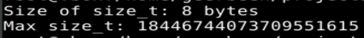  
Очевидно, що стільки система виділити не зможе фізично, але спробуємо.
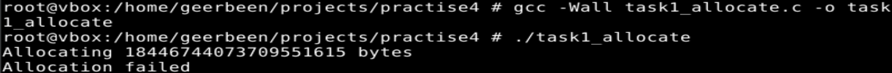  
Як і очікувалось отримаємо помилку. Я намагався виділити 16 ексабайт, система стільки не має, а навіть якби мала, то існує обмеження на віртуальний простір близько 256 терабайт.
## Завдання 2
malloc при отримання signed int значення спробує перетворити його в unsidned int або ж ```size_t```.
Давайте зробимо це за нього та подивимось що вийде.
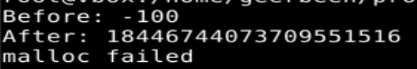  
Як бачимо, при перетворенні негативного числа, результат переповнюється і ми отримуємо величезне значення, через що виділення не вийде.

При переповненні числа отримуємо схожу поведінку, воно переповнюється і стає від'ємним, через що виділення аналогічно до минулого не вийде (від'ємне знову перетвориться і переповниться)  
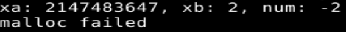  
## Завдання 3
malloc(0) повернув робочий ненульовий вказівник, але ми не зможемо нічого туди записати. Також його можна передати в free().
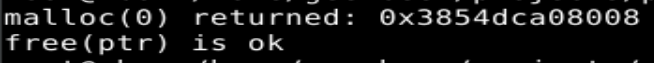  
## Завдання 4  
Проблемою такого коду стає те, що функція free() не задає значення посиланню ```NULL```, а посилання стає таким, яке називають dangling pointer, функція повідломляє jemalloc що виділений блок більше не потрібен, а посилання не змінюється. Подальше використання можливе, але може привести до помилок. Найпростішим рішенням було б після звільнення явно вказувати посиланню ```NULL```:
``` C
free(ptr);
ptr = NULL;
```
Іншим рішенням було б прибрати ```if``` конструкцію та банально виділяти пам'ять завжди без зайвих перевірок.
Приклад з неправильним використанням:  
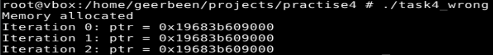  
Тут для демонстрації  банально доданий ```printf()```, ми бачимо що пам'ять виділяється всього раз, бо перевірка на NULL не працює в подальших ітераціях.  
Приклад з правильним використанням (без умови):  
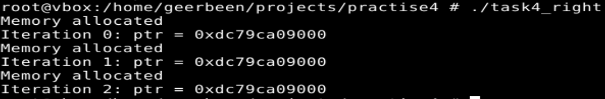  
Тут було додано присвоєння ```NULL```, і як бачимо це чудово працює і змушує ```malloc()``` повторно виділяти пам'ять
## Завдання 5  
Якщо ```realloc()``` не зможе виділити пам'ять то повернеться ```NULL```, а з старим вказівником нічого не станеться.  
В програмі довелося намагатись перевиділити пам'ять аж 100 террабайт, система спочатку виділяла не фізичну пам'ять, а резервувала віртуальні адреси.
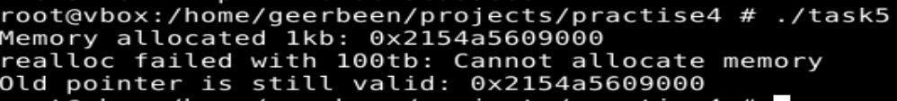  
Програма перевіряє чи повернене значення не є ```NULL``` та якщо є виводить демонстративну помилку.
## Завдання 6  
У випадку передання ```NULL``` та числа, ```realloc``` має діяти як ``malloc``, що здається і відбувається.  
 ```realloc``` з переданим 0 мав би повернути ```NULL```, але в моїй системі я отримав нове посилання, яке скоріш за все має мінімально можливий до виділення розмір.
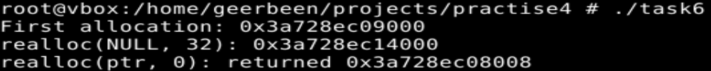  
## Завдання 7
reallocarray(ptr,n,size) це буквально realloc(ptr,n*size), тому жодних змін не очікуємо.   
Виклик з ```reallocarray```:
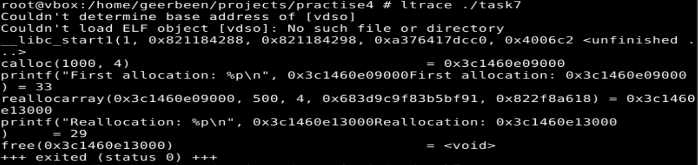  
Виклик з ``realloc``:
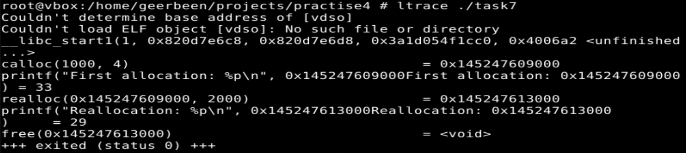  
Як і очікувалось, різниці крім назви функцій та аргументів немає.
## Завдання 8
FreeBSD не підтримує mallopt(), тому я використав Ubuntu. Також довелось використати strace, замість ltrace щоб побачити виклик  ```mmap()```.
В коді я змінив поведінку ``malloc()`` так, щоб при виділення більше вказаної кількості пам'яті, використовувалось ```mmap()``` замість ``sbrk()``.
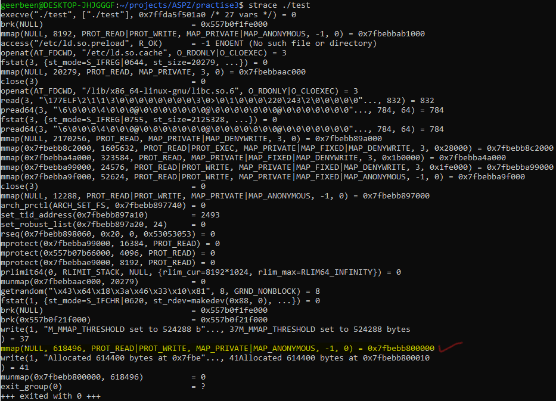  
