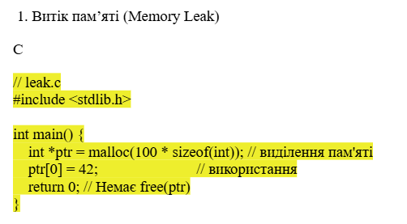
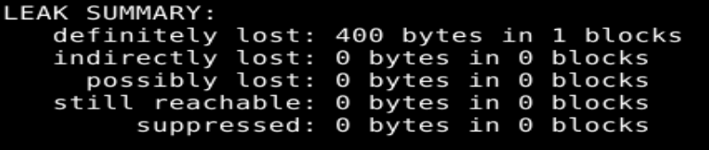
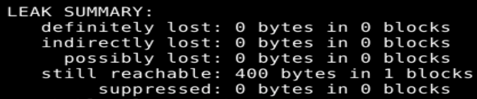

# ТВ-32 Михайленко Роман Практична робота 5
## Варіант 13
### Завдання:
Напишіть фрагмент, в якому valgrind не може однозначно визначити утечку пам’яті, хоча вона є.
### Рішення:  
У прикладі з практики leak.c відбувається витік пам'яті.  
  
  
Valgrind повідомляє, що втратилось 400 байтів пам'яті.  
Витік пам'яті - ситуація, коли пам'ять була виділена, але не була звільнена, а посилання на неї втрачене, що унеможливлює звільнення.  
https://valgrind.org/docs/manual/mc-manual.html#mc-manual.leaks  
Документація каже:  
 ``Memcheck keeps track of all heap blocks issued in response to calls to malloc/new et al. So when the program exits, it knows which blocks have not been freed.``  
Valgrind відслідковує всю пам'ять в купі, що була виділена динамічно (а вся динамічно виділена пам'ять виділяється з купи). Отже Valgrind буде знати, якщо пам'ять не звільниться, а посилання залишиться, а така ситуація протирічить визначенню витоку, тому Valgrind вже не зможе явно сказати що це саме витік.
Тоді моя задача змусити з'явитись витоку пам'яті, але таким чином, щоб посилання залишилось в програмі до кінця виконання.  
З минулих практик відомо, що локальні змінні і посилання зберігаються в стеку, який знищується після завершення функція, а от глобальні існують протягом всього виконання програми в BSS, тому можна переробити код з прикладу, просто зробивши посилання глобальним.  
``` valgrind --leak-check=full ./leak```
  
Справцювало, тепер пам'ять більше не ``definetely lost``, а `` still reachable``. Valgrind вважає, що програма могла б дістати пам'ять під час подальшого виконання, через те, що посилання досі існує, але витік всеодно стався.
