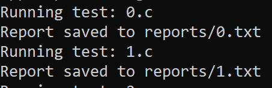
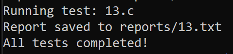
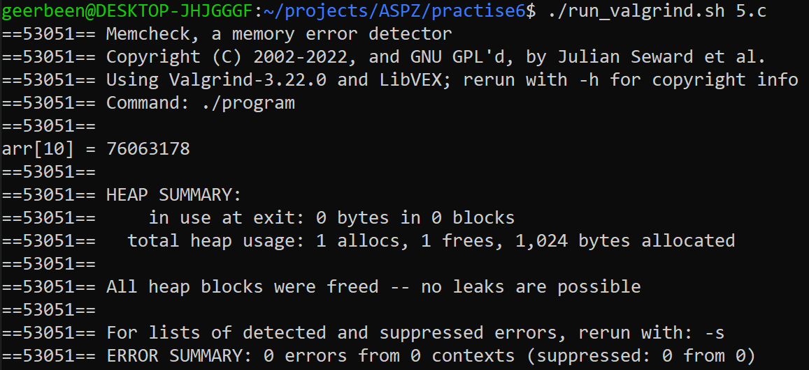

# ТВ-32 Михайленко Роман Практична робота 6
## Варіант 13
Спочатку було написано x.c файли з тестовими програмами, що мали би викликати помилки, де x - номер test case.  

Створено скрипт, що запускав би всі файли з тестами та зберігав результат у відповідній директорії - [test_all.sh](test_all.sh). Ітерується по масиву з іменами файлів, логує в термінал поточний, перевіряє існування, виводить помилки компіляції і основне - запускає з valgrind та записує звіт.  
Далі написано Dockerfile для побудови контейнеру. Встановлюється gcc, valgrind, копіюються описані файли, для шелл файлу встановлюється можливість виконатись і відповідно виконується.   
  
  
Звіти зберігаються в директорії reports. Аналізуючи отримані результати, всі помилки очікувані. Але от для 5 test-case помилки не відбулось, програма вивела випадкове значення з пам'яті, як і було очікувано.
  
Для отримання доступу до звітів ззовні директорія з результатами монтувалась як том, інакше звіти залишились би в контейнері по закінченню виконання та просто зникли.
```docker run -v $(pwd)/reports:/app/reports valgrind-tests```  
Отже, було реалізовано сценарій, який виконує тести з valgrind та зберігає звіти.
