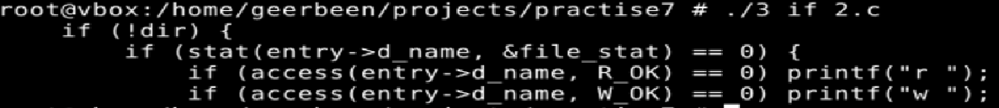

# ТВ-32 Михайленко Роман Практична 7
## Варіант 13
### Завдання 1  
Функція ```popen()``` повертає файловий потік. Для початку отримуємо потік читання ``who`` і доступ до списку користувачів відповідно. Далі відкриваємо для запису more та записуємо сюди читаючи з ``who``. Закриваємо обидва потоки.  

### Завдання 2
Програма відкриває поточну директорію, за допомогою `readdir` в циклі ітерується по файлам, для кожного отримує інформацію. За допомогою `access` з `unistd` перевіряє права доступу читання і запису. Виводить розмір та назву файлу.  

### Завдання 3
Програма відкриває файл, зчитує построчно з `fgets`, перевіряє з `strstr`, при співпадінні виводить, закриває файл.  
  
### Завдання 4
Програма приймає як аргументи імена одного або більше файлів. В циклі рахує кількість виведених рядків, якщо 20, то очікує вводу і виводить далі.  
   
### Завдання 5
Програма відкриває поточну директорію, виводить імена файлів, якщо трапляється директорія то рекурсивно виводить файли вже цієї директорії. Працює схоже до минулих завдань, але додав ігнорування `.` `..`   
   
### Завдання 6
Програма з поточної директрої отримує імена внутрішніх директорій, зберігає їх, сортує та виводить у алфовітному порядку. У багатьох системах за замовченням файли і директорії і так сортуються за алфавітним порядок, але так як це можна змінити, виходить, що система не гарантує такий порядок.  
   
### Завдання 7
Програма отримує `.c` файли з поточної директорії, запитує чи дати дозвіл, якщо ствердно - за допомогою `chmod` надає такий з бітовою маскою `S_IROTH`.  
   
### Завдання 8
Працює аналогічно до минулого завдання, але тепер замість перевірки на `.c` перевіряє чи це звичайний файл і замість доступу видаляє.  
   
   
Як бачимо, перші компільовані файли справді зникли.
## Завдання 9
Програма приймає як аргумент ім'я компільованого файлу. Через `system()` запускає його та вимірює час з `gettimeofday()`. Таким чином програма стає універсальною.  
   
## Завдання 10
Програма приймає як аргумент праву межу для другої генерації. Генерує число від 0 до 1 та від 0 до вказаного.
   
## Завдання 13
Я не зміг знайти визначення аномальних файлів, тому буду вважати такими ті, що мають доступ `777`. Програма для вказаних директорій перевіряє всі виконувані файли і виводить їх список, вказуючи, якщо рівень доступу `777`.
   
