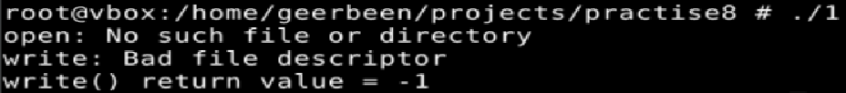
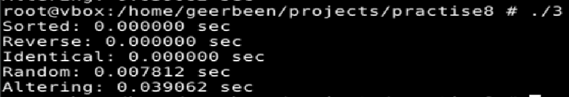
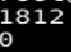
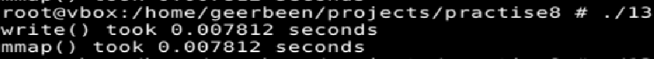

# ТВ-32 Михайленко Роман Практична 8
## Варіант 13
### Завдання 1  
`write(fd, buffer, nbytes)` повертає кількість записаних байтів, або `-1` при помилці, якщо потрібно отримати менше nbytes, то очевидним рішенням стає викликати помилку. Наприклад, можна спробувати відкрити неіснуючий файл і не оброблювати помилку.   
   
### Завдання 2  
Для зберігання байтів використаємо двійковий файл `.bin`. Маючи відкритий файл з покажчиком на початку `lseek(fd, 3, SEEK_SET);` "пропустить" перші 3 байти та встановить покажчик на індекс 3. Тоді `read(fd, buffer, 4);` прочитає наступі 4 байти, від 3 до до 6 включно індексів.   
Пропустить 4, 5, 2   
Виведе 2, 3, 3, 7   

### Завдання 3  
Програма перевіряє роботу функції `qsort()`. Функція перевірки змушує сортувати числа за зростанням. Спочатку я хотів підсунути алгоритму сортований або сортований за спаданням масиви - тоді якби обиралась початкова або кінцева точки як `pivot` для алгоритму це було б сумно. Але виявилось, що не все так просто - час сортування становив майже 0 секунд. `pivot` обирається якимось розумним чином. Сортування для випадкового масиву зайняло більше часу, тоді подумав, що особливого у випадкового і як це замаксити? Скоріш за все те, що малі і великі значення перемішувались, що змушувало алгоритм часто міняти їх місцями. Отже вірогідним найгрішим варіантом для `qsort` є масив у якому такі такі значення чергуються не випадково, а завжди, що і було реалізовано.  
  
### Завдання 4  
fork() розділить виконання програми на 2 ідентичні процеси з місця виклику. У оригіналі повертає PID процесу копії, у копії 0 - щоб зручно розрізняти. Тому вивід буде  
PID   
0   

### Завдання 13  
Програма реалізовує функції що вимірюють швидкість при запису в файл з використанням `write` & `mmap`.   
Для першого випадку відкривається файл, записуються дані, файл закривається.  
Для другого файл відкривається, корегується розмір за допомогою `ftruncate`, створює відображення файлу у пам'яті, заповнює відображення, відображення синхронізується з файлом, файл закривається.
Для простих дій, особливої різниці у використанні немає, `write` навіть зручніше, адже вимагає менше дій.
