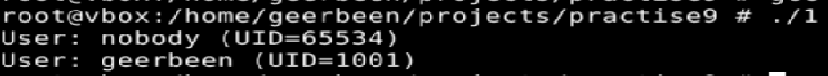
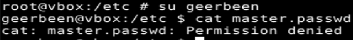
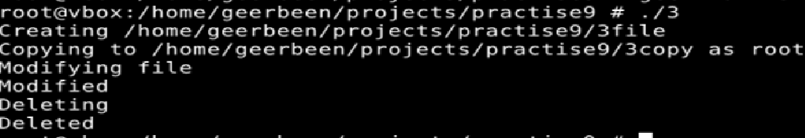
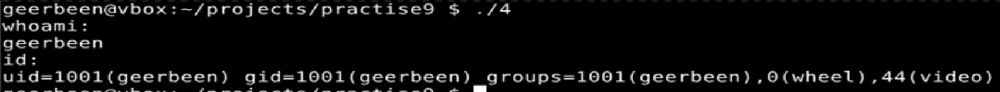
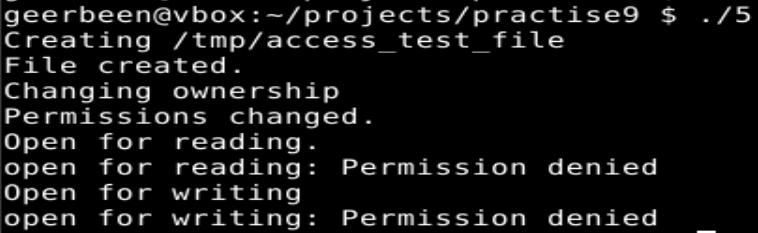
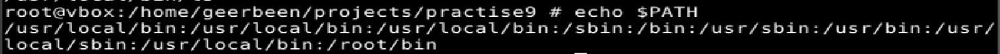
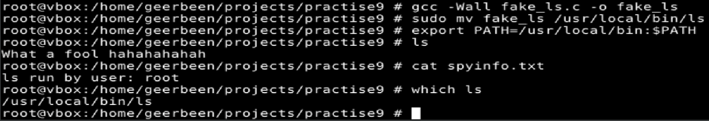
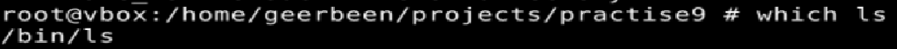

# ТВ-32 Михайленко Роман Практична 9
## Варіант 13
### Завдання 1  
Програма запускає `getent passwd`, отримує `uid` того, хто запускає. Розбиває файл по `":"`, якщо перевіряє на наявність `uid & username`, якщо є - то це юзер, перевіряє чи співпадає з моїм `uid`, якщо ні, то виводить.  
   
### Завдання 2  
Як виявилось, FreeBSD не має `etc/shadow`, але є схожий файл `etc/master.passwd`, що також зберігає паролі.
  
Програма в будь якому випадку запитує пароль до `sudo`, навіть у звичайного користувача.
  
### Завдання 3  
Програма створює, копіює модифікує, видаляє файли з різним рівнем доступу.  
  
### Завдання 4  
Програма по черзі виконує команди `whoami` & `id` від імені того, хто запустив її.  
  
### Завдання 5  
Програма створює файл від імені виконавця, змінює права доступа і належності з `chmod` & `chown` та намагається прочитати та записати - отримує відмову.  
  
### Завдання 6  
Фейкова програма жорстко насміхається над юзером та записує в файл ім'я того, хто виконав `ls`.  
Для того, щоб це працювало треба перемістити бажаний виконуваний файл в директорію, яка буде мати більший пріорітет в `PATH`:
 
Тоді перемістивши такий файл, при виконанні `ls` буде виконуватись бажаний файл. Це має значну перевагу над тим, щоб просто назвати файл ls, бо тепер він виконується без `./` і з будь-якої директорії.   
   
Дізнатися, що програма фейкова, можна, наприклад за допомогою `which`. Ось таким має бути вивід для оригінальної програми:  
   
А який я встановив, видно на минулому скриншоті.
